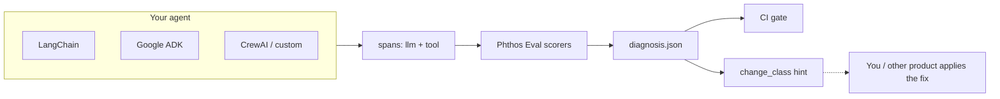
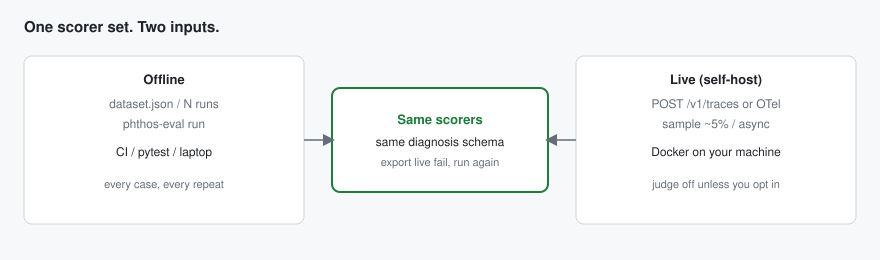
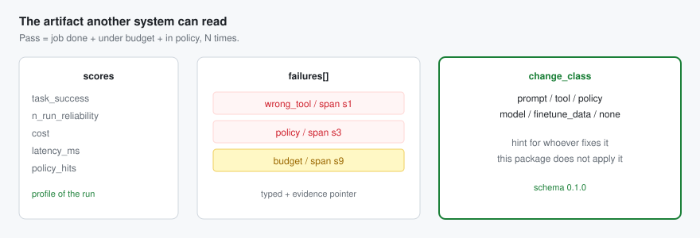
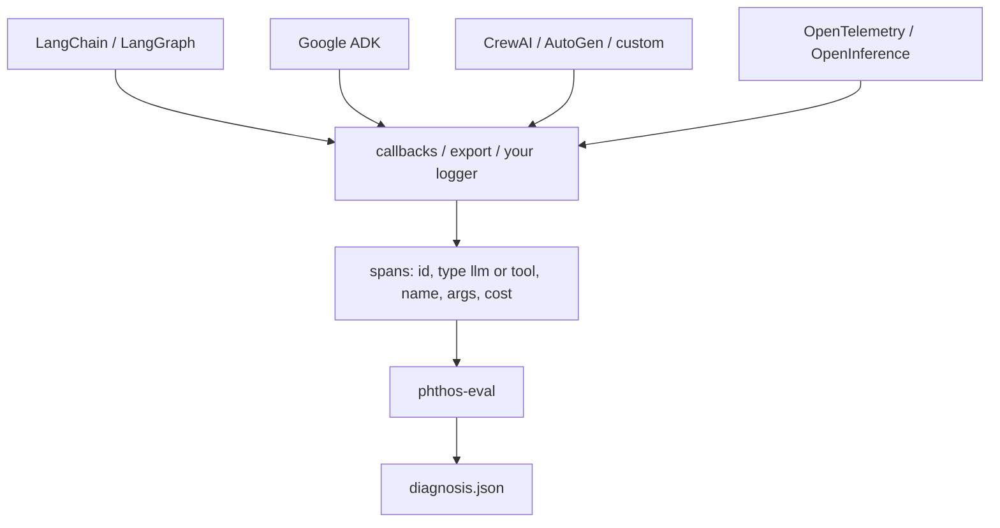
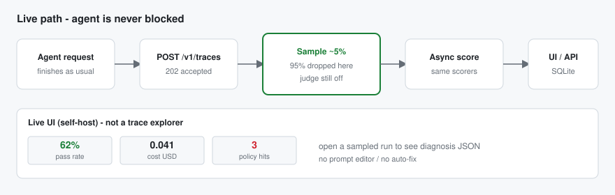
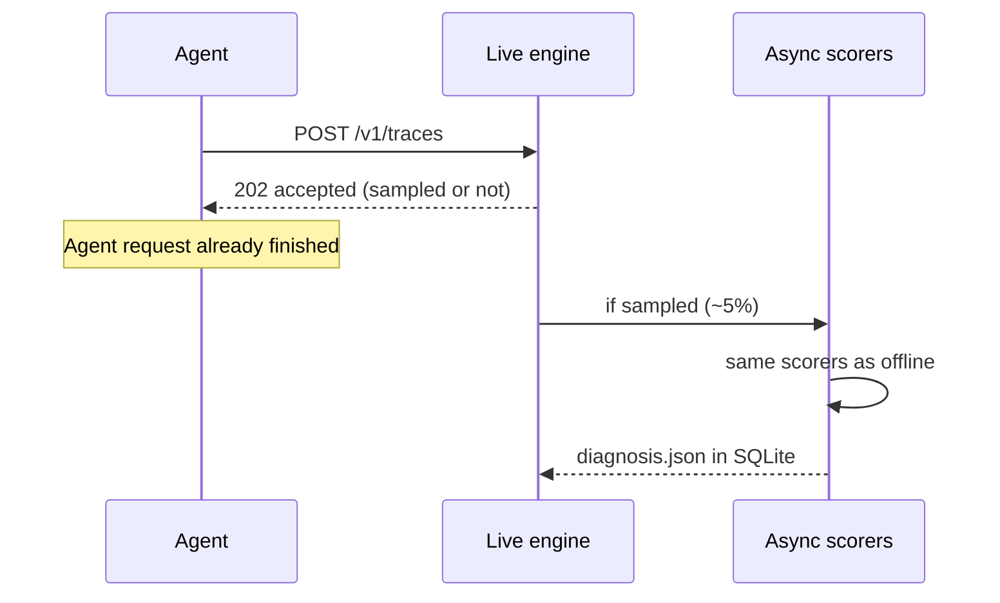

# Phthos Eval

Score an **agent run**, not a chat reply.

An agent can answer fluently and still call the wrong tool, loop, blow the budget, or break policy. Phthos Eval reads recorded traces (LLM steps + tool calls) and writes a **diagnosis JSON** you can gate CI on or hand to another system. It does **not** rewrite prompts, open PRs, or fine-tune.


Python 3.11+. Install from PyPI:

```bash
pip install phthos-eval
```

[PyPI](https://pypi.org/project/phthos-eval/) · [GitHub](https://github.com/PhthosAI/phthos-eval)



---

## What you get

1. **Deterministic checks** (no API key): expected tools, argument shape, cost/step budget, deny-list policy, repeated tool loops.
2. **N-run reliability**: the same case is scored more than once so a lucky pass does not look like a good agent.
3. **A diagnosis file**: scores, typed failures with span ids, and a `change_class` hint (`tool`, `policy`, `prompt`, …).

Optional: an LLM **judge** using **your** key. Without a key, everything above still runs.





### Sample scores (bundled fixture)

`python -m phthos_eval run -d fixtures/dataset.json` — 5 cases, 2 runs each. One case is clean; the others are seeded failures.

| Metric | Value | What that means on this suite |
|--------|------:|-------------------------------|
| `task_success` | 0.20 | 1 of 5 cases passed **both** runs |
| `n_run_reliability` | 0.20 | Same as task success in this version |
| `cost` | 1.71 | USD summed across scored traces |
| `latency_ms` | 8593 | Summed span latency |
| `policy_hits` | 2 | Deny-list hits (`send_money`) |
| `change_class` | `policy` | Highest-priority hint (policy before tool/budget/loop) |

| Case | Passed | What fired |
|------|:------:|------------|
| `pass-search` | yes | — |
| `fail-wrong-tool` | no | `wrong_tool` |
| `fail-budget` | no | `budget` |
| `fail-policy` | no | `policy` (and `wrong_tool`: denied tool is not in the allow-list) |
| `fail-loop` | no | `loop` |

Support-agent dogfood (`examples/support_agent/dataset.json`): `task_success` **0.50**, `cost` **0.008**, `policy_hits` **2**, `change_class` **policy**. `status-ok` passes; `refund-denied` fails.

---

## Any agent stack (LangChain, Google ADK, …)

Phthos Eval does **not** import LangChain, Google ADK, CrewAI, LlamaIndex, AutoGen, or similar. Those packages **run** the agent. We **score** what it did.

Seamless here means one shared **trace shape**, not a plugin inside each framework:



**Today:** you map your framework’s events into that JSON (a small callback or post-run dump). Then `phthos-eval run` is the same for every stack.

**Typical mappings**

| Stack | Where traces already exist | What you map |
|-------|----------------------------|--------------|
| LangChain / LangGraph | Callbacks, LangSmith export, or run tree | Each LLM/tool event → one span |
| Google ADK | Session / event log | Tool calls → `type: tool` |
| CrewAI / AutoGen | Step / message log | Same |
| Anything on OpenTelemetry / OpenInference | Span export | Filter LLM + tool spans |

You do **not** wrap the agent in a Phthos runtime. Swap LangChain for ADK and the **eval file stays valid** as long as spans still look like the table above.

**Live:** `POST /v1/traces` with that span JSON, or OTLP/HTTP JSON (`openinference.span.kind` / `gen_ai.tool.name`) to a self-hosted engine. See [Live engine](#live-engine-self-host).

---

## Quick start

Save traces as JSON (see [Dataset format](#dataset-format)), then:

```bash
python -m phthos_eval run -d eval/dataset.json -o diagnosis.json
python -m phthos_eval check diagnosis.json
```

Fail CI when anything is wrong:

```bash
python -m phthos_eval run -d eval/dataset.json -o diagnosis.json --fail-on-findings
```

Try the bundled examples after cloning this repo:

```bash
python -m phthos_eval run -d fixtures/dataset.json -o diagnosis.json
python -m phthos_eval run -d examples/support_agent/dataset.json -o diagnosis.json
```

---

## Live engine (self-host)

Same scorers as offline, on a **sampled** production stream. You run the process; data stays on your machine. This is not a hosted SaaS and not a LangSmith clone.





```bash
# default sample rate 5%, judge off
phthos-eval live -c examples/live/config.json

# or
docker compose up --build
```

UI at http://127.0.0.1:8765 — pass rate, cost, policy hits, open a run to see diagnosis JSON. No prompt editor.

Ingest does **not** wait for scoring:

```python
from phthos_eval.live import LiveClient

client = LiveClient("http://127.0.0.1:8765")
client.ingest(spans=[...], agent_id="support", expected_tools=["search"])
```

`GET /v1/scores` · `GET /v1/diagnoses/{id}` · `POST /v1/diagnoses/{id}/export` writes an offline dataset you can `phthos-eval run`.

Demo (forces 100% sample — **not** for production):

```bash
PHTHOS_EVAL_SAMPLE_RATE=1 docker compose up --build
phthos-eval live-demo
```

Full Compose / OTel / cost knobs: [`examples/live/README.md`](examples/live/README.md).

**Do not bankrupt yourself:** default is 5% sample and **no** LLM judge. A judge key on 100% of live traffic is usually more expensive than the agent. Opt in with `--live-judge` plus `OPENAI_API_KEY` / `PHTHOS_EVAL_API_KEY` only if you accept that bill.

---

## Integrate in a project

### 1. Record traces

When your agent runs (tests or a small harness), write spans like:

```json
{
  "spans": [
    { "id": "s0", "type": "llm", "latency_ms": 120, "cost_usd": 0.002 },
    {
      "id": "s1",
      "type": "tool",
      "name": "lookup_order",
      "args": { "order_id": "A-100" },
      "latency_ms": 30,
      "cost_usd": 0.0
    }
  ]
}
```

You do not run the agent *through* Phthos Eval. You export what it did, then score the export.

### 2. Put cases in a dataset

One file per suite. Each case needs `n_runs` traces (default in examples: **2**) so reliability is real.

```json
{
  "id": "my-agent",
  "n_runs": 2,
  "budget": { "max_cost_usd": 0.05, "max_steps": 8 },
  "policy": { "deny_tools": ["issue_refund"] },
  "tool_schemas": {
    "lookup_order": { "required": ["order_id"] }
  },
  "cases": [
    {
      "id": "status-ok",
      "expected_tools": ["lookup_order"],
      "traces": [{ "spans": [] }, { "spans": [] }]
    }
  ]
}
```

### 3. Call from Python (pytest)

```python
import json
from pathlib import Path
from phthos_eval import run_dataset, validate_diagnosis

def test_agent_eval():
    dataset = json.loads(Path("eval/dataset.json").read_text())
    doc = run_dataset(dataset)
    assert validate_diagnosis(doc) == []
    assert doc["change_class"] == "none"
    assert doc["scores"]["n_run_reliability"] == 1.0
```

Custom check (still deterministic — no LLM):

```python
from phthos_eval import failure, run_dataset

class NoEmptyTrace:
    def score(self, trace, *, case, dataset, case_id, trace_index):
        if not trace.get("spans"):
            return [failure("policy", "empty", case_id=case_id, trace_index=trace_index)]
        return []

doc = run_dataset(dataset, scorers=[NoEmptyTrace()])  # replaces defaults; add default_scorers() to keep them
```

To keep built-in scorers **and** yours:

```python
from phthos_eval import default_scorers, run_dataset

doc = run_dataset(dataset, scorers=[*default_scorers(), NoEmptyTrace()])
```

### 4. GitHub Actions

```yaml
- uses: actions/setup-python@v5
  with:
    python-version: "3.12"
- run: pip install phthos-eval
- run: python -m phthos_eval run -d eval/dataset.json -o diagnosis.json --fail-on-findings
```

Full copy-paste: [`examples/github-eval.yml`](examples/github-eval.yml).

---

## Dataset format

| Field | Role |
|-------|------|
| `n_runs` | How many traces per case must exist and be scored |
| `budget.max_cost_usd` / `max_steps` | Fail the trace if cost or tool-call count is over the cap |
| `policy.deny_tools` | Fail if that tool was called |
| `tool_schemas` | Fail if a known tool is missing required args |
| `cases[].expected_tools` | Fail if a tool call is not in this allow-list |
| `cases[].traces` | Recorded runs; each span needs `id`, `type` (`llm` or `tool`) |

Tool spans: `name`, `args`, optional `cost_usd`, `latency_ms`.

---

## Metrics (what they mean)

These are on the **whole suite** in `diagnosis.json` → `scores`. Numbers in **Example** are from `fixtures/dataset.json` (table above).

| Metric | Range | Example | Why it matters |
|--------|--------|--------:|----------------|
| `task_success` | 0–1 | 0.20 | Share of cases where **every** N-run passed. A pretty last message does not count. |
| `n_run_reliability` | 0–1 | 0.20 | Same as `task_success` in this version: did the case pass on all repeats? Single-run “90%” is often luck. |
| `cost` | USD (sum) | 1.71 | Token/tool spend across scored traces. A correct 40-call run can still be a failed product. |
| `latency_ms` | ms (sum) | 8593 | Time in the recorded spans. Useful for p95-style budgets later; here it is the total you logged. |
| `policy_hits` | count | 2 | How many deny-list (or custom policy) failures fired. Safety/compliance, not “quality vibe”. |

`judge.score` (0–1) appears only if you set a judge key. Treat it as extra signal, not the verdict. Deterministic failures are the source of truth.

Per case: `cases[]` has `passed` and that case’s `failures`.

---

## Failures and `change_class`

Each failure has a `type`, a `span_id`, and `evidence` (span / step / case / which of the N traces). Types:

| Type | Trigger | Typical `change_class` |
|------|---------|-------------------------|
| `wrong_tool` | Tool not in `expected_tools`, or missing required args | `tool` |
| `policy` | Tool on `deny_tools` | `policy` |
| `budget` | Over `max_cost_usd` or `max_steps` | `model` |
| `loop` | Same tool + args ≥ 3 times in one trace | `prompt` |

`change_class` is a **hint** for whatever improves the agent (you, CI, a later tool). This package does not apply the change.

Values: `prompt` · `tool` · `policy` · `model` · `finetune_data` · `none` (clean run).

---

## Optional LLM judge

Not required. Deterministic scorers always run.

| Variable | Use |
|----------|-----|
| `OPENAI_API_KEY` or `PHTHOS_EVAL_API_KEY` | Your judge key |
| `PHTHOS_EVAL_JUDGE_BASE_URL` | OpenAI-compatible URL (OpenAI, Ollama, a gateway, …) |
| `PHTHOS_EVAL_JUDGE_MODEL` | Model id (default `gpt-4o-mini`) |
| `PHTHOS_EVAL_LIVE_JUDGE` | Live engine only: set to `1` (or `--live-judge`) to run the judge on **sampled** traces. Off by default so a leftover key cannot bill every ingest. |

Do **not** reuse the **agent’s** production keys as the judge unless you intend that. Agent keys run the system under test; judge keys only score. With no judge key, `judge.skipped` is `true` and `reason` is `no_key`.

---

## What this is not

- Not LangSmith (no prompt playground, no hosted cloud accounts).
- Not an auto-fixer or fine-tuner. Export a failing live run; you (or another product) apply the change.
- Not a hosted LLM. OSS / self-host uses your machine and, optionally, your judge key.

---

## Develop this repo

```bash
pip install -e ".[dev]"
python -m pytest
python -m ruff check src tests
```

License: MIT.
